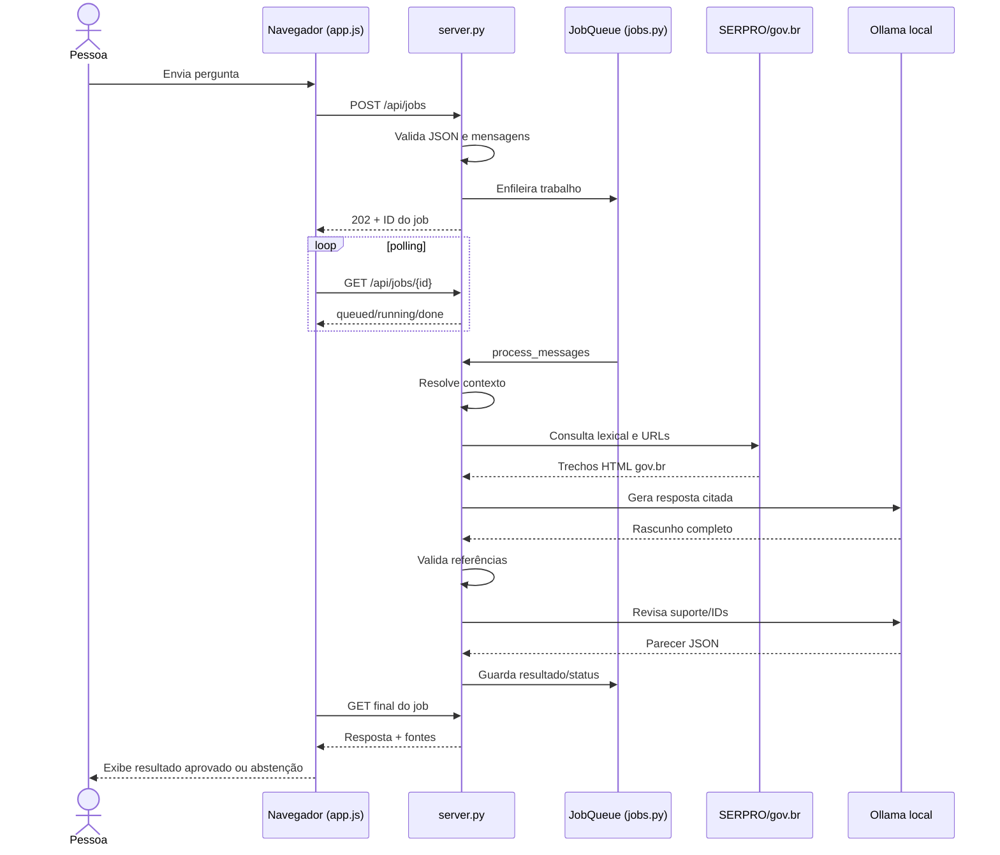
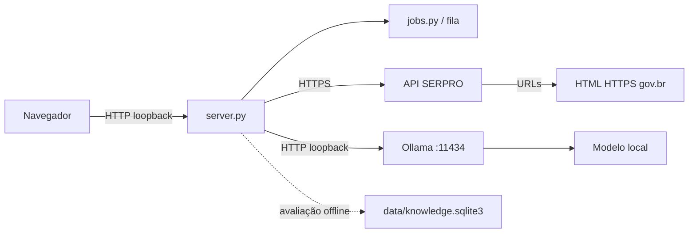
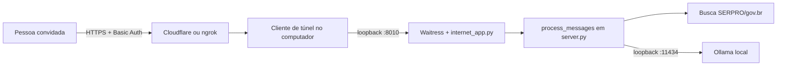

# 14. Diagramas

## Pergunta no modo local

## Dependências do modo local

Linha pontilhada indica uso auxiliar: o chat online atual não consulta o SQLite.

## Modo externo opcional

O provedor externo faz parte desse caminho; ele não aparece no modo local.
