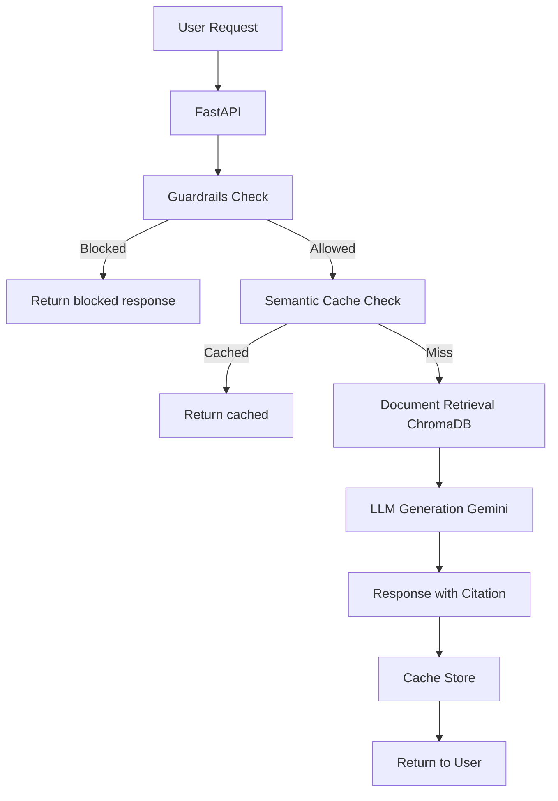

## Context

O SUS-DF precisa de um Chatbot Administrativo altamente escalável e rigorosamente limitado a não fornecer informações clínicas. Temos que garantir um SLA de 15 segundos para responder as mensagens do cidadão via web e prover ferramentas para acompanhar os experimentos de MLOps.

## Goals / Non-Goals

**Goals:**
- Prototipar UI minimalista baseada no Design System Susana.
- Orquestrar o pipeline MLOps: DVC para os dados de entrada, MLflow para os experimentos de RAG.
- Implementar cache com Redis para contornar o custo e a latência de chamadas frequentes ao LLM.
- Isolar o roteamento clínico usando NeMo Guardrails para falhar rápido e seguro ("fail-fast").

**Non-Goals:**
- Integração com sistemas de banco de dados do prontuário eletrônico.
- Implementação de um modelo próprio fine-tuned (usaremos o Gemini 3.1 Pro via API inicialmente).

## Decisions

- **Framework Web**: Next.js no frontend para facilidade no roteamento e prototipação, e FastAPI no backend por ser o padrão de mercado para MLOps e compatível asincronamente com LangChain.
- **RAG com Semantic Cache**: Escolhida biblioteca LangChain integrada a um Redis Vector Store na borda. Isso resolve a meta de < 15s sem escalonar o tráfego do LLM.
- **Guardrails pré-LLM**: Uso do NeMo Guardrails por sua performance e clareza na declaração de fluxos proibidos (bloqueio clínico).

## Risks / Trade-offs

- **Risk: Atrasos na rede até a API do LLM** → *Mitigation:* Cache semântico na borda.
- **Risk: Falsos positivos no Guardrails** bloqueando perguntas legítimas → *Mitigation:* Regras com alta especificidade nos prompts de roteamento e logging para fine-tuning posterior.
- **Risk: Fuga do contexto RAG ("Alucinação")** → *Mitigation:* LLM restrito a responder "Apenas" com o contexto recuperado e forçar o envio da Citação na UI.

## Architecture Diagram

