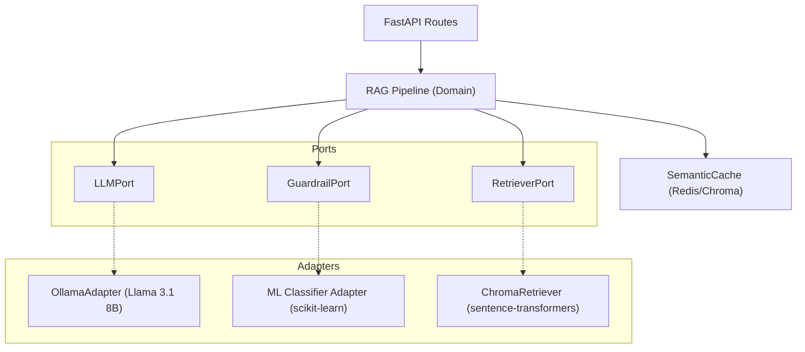

# Design: Pipeline de IA Local (Susana)

## Arquitetura
O backend adota o padrão de **Arquitetura Hexagonal (Ports & Adapters)**.
- O domínio (pipeline RAG) se comunica com a camada de IA via abstrações (`LLMPort`, `IntentClassifierPort`).
- Adaptadores (`OllamaAdapter`, `ScikitLearnGuardrail`) injetam o comportamento.

## Decisions (ADRs)

### ADR-1: Modelo LLM Local via Ollama vs APIs Externas
**Decisão:** Usar o Ollama rodando localmente com o modelo Llama 3.1 8B.  
**Justificativa:** Garantia de soberania dos dados da SES-DF. Sem dependência externa, mitigamos risco de LGPD. Ollama facilita a gestão (pull/run) e provê uma API HTTP compatível.

### ADR-2: Guardrail (Regex vs Classificador de ML)
**Decisão:** Utilizar um Classificador ML (scikit-learn, e.g., LogisticRegression com TF-IDF) somado a um fallback de Regex. O modelo deve seguir uma estratégia *fail-closed*.  
**Justificativa:** Regex sozinho é frágil e produz falsos positivos ou falsos negativos frente a reformulações semânticas. O classificador será treinado em um dataset curado em português. **Atenção**: O XGBoost falhou durante os testes por conflitos de OpenMP (macOS), logo a regressão logística no scikit-learn se tornou a alternativa mais segura e rápida de inferência.

### ADR-3: Seleção de Modelos de Embedding
**Decisão:** Selecionar via script avaliativo (Benchmark). Os candidatos são: `all-MiniLM-L6-v2`, `paraphrase-multilingual-MiniLM-L12-v2`, `multilingual-e5-small` e `bge-m3`.  
**Justificativa:** Precisamos de alta precisão no idioma Português sem sacrificar o tempo de resposta ou tamanho em disco.

### ADR-4: Pipeline MLOps (DVC + MLflow)
**Decisão:** Utilizar DVC local para trackear os datasets e MLflow (com backend SQLite e Artifact Store local) para rastrear os experimentos de treinamento e o Model Registry, adotando o alias `@champion`.  
**Justificativa:** Reprodutibilidade. Permite auditar qual versão do dataset gerou o classificador em produção. Evita ferramentas pesadas (como Kubeflow) em um escopo que ainda é de Prova de Conceito / Validação.
