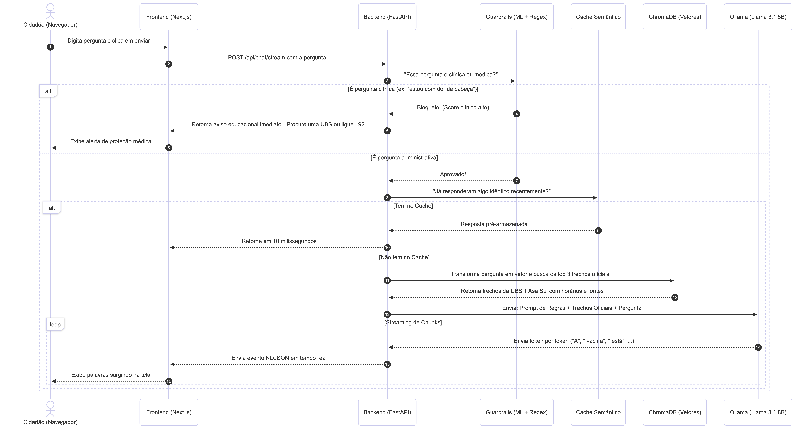

# Relatório Técnico: Arquitetura e Implementação da Assistente Susana RAG

## 1. Introdução e Objetivo Estratégico
O presente relatório descreve as decisões arquiteturais, o processo de preparação de dados e os critérios técnicos que embasaram o desenvolvimento da **Susana**, uma assistente virtual administrativa focada nos serviços do SUS-DF. 

O maior desafio técnico do projeto foi garantir uma separação rígida entre **informação administrativa** (horários, unidades, documentos, programas) e **informação clínica** (diagnósticos, dosagens, conselhos médicos), exigindo a construção de um pipeline que aliasse flexibilidade conversacional com segurança de dados e proveniência estrita (aterramento).

---

## 2. Processo de Preparação de Dados e Indexação (RAG)

### 2.1 Fontes de Dados (Corpus)
A estratégia adotada para o RAG (Retrieval-Augmented Generation) priorizou dados abertos oficiais e guias estruturados. A base incluiu:
* Arquivos `.csv` abertos contendo o registro de Unidades Básicas de Saúde (UBS), Unidades de Pronto Atendimento (UPAs) e metadados de produção.
* Transformação de páginas web oficiais (URLs do Ministério da Saúde e SES-DF) em arquivos `.json` estruturados.
* Documentos textuais de perguntas frequentes (FAQs), como os direcionados ao Meu SUS Digital e Campanhas de Vacinação.

### 2.2 Curadoria e Limpeza
Para maximizar a precisão vetorial (Evitar *Retrieve* de informações mórbidas irrelevantes ao atendimento primário), foi realizado um corte manual de escopo. Documentos como bases de óbitos foram purgados do Corpus para evitar contaminação semântica durante as interações diárias.

### 2.3 Indexação e Vetorização
Os dados brutos passam por uma rotina automatizada (`index_corpus.py`) de *chunking* (segmentação de textos) antes de serem inseridos no banco vetorial.
* **Banco de Dados Vetorial:** Utilizamos o **ChromaDB** pela capacidade de rodar localmente e em memória/persistência simples, garantindo isolamento da aplicação.
* **Modelo de Embeddings:** Optou-se pelo modelo `paraphrase-multilingual-MiniLM-L12-v2`. Esse modelo foi selecionado por possuir uma latência de processamento curtíssima com altíssima performance para língua portuguesa, mapeando semântica de 512 tokens por bloco.

---

## 3. Seleção de Modelos e Processamento Inteligente

### 3.1 Visão Geral da Arquitetura e Fluxo de Execução (Diagrama de Sequência)
Para compreender a dinâmica operacional do sistema de ponta a ponta — desde o momento em que o cidadão insere uma mensagem no navegador até a entrega da resposta fundamentada por streaming —, o diagrama de sequência a seguir mapeia a interação síncrona e assíncrona entre o Frontend (Next.js), Backend (FastAPI), Guardrails semânticos (ML + Regex), Cache Semântico, ChromaDB (Vetores) e o LLM local (Ollama / Llama 3.1 8B):


*Figura 1: Diagrama de Sequência do pipeline de execução da assistente Susana RAG, evidenciando o desvio de segurança clínica, o cache semântico de baixa latência e a recuperação vetorial com geração fundamentada em streaming.*

#### Detalhamento das Etapas do Fluxo:
1. **Entrada do Cidadão:** O usuário digita a pergunta na interface web (Next.js), que dispara uma requisição `POST /api/chat/stream` para o backend FastAPI.
2. **Barreira Preventiva (Guardrails ML + Regex):** Antes de qualquer consulta a bancos ou modelos de linguagem, a mensagem é submetida à camada de triagem clínica.
   * *Ramificação Clínica:* Se a mensagem for classificada como consulta médica, sintomas ou solicitação de conduta (ex: *"estou com dor de cabeça"*), a execução é interceptada imediatamente com bloqueio por score clínico elevado. O backend retorna um aviso educacional de proteção imediato (*"Procure uma UBS ou ligue 192"*), exibido na interface sem consumir recursos vetoriais ou computacionais do LLM.
   * *Ramificação Administrativa:* Se aprovada como consulta institucional/administrativa, a mensagem é liberada para a próxima etapa.
3. **Consulta ao Cache Semântico:** O sistema avalia se uma dúvida com semântica equivalente já foi respondida recentemente. Havendo correspondência no cache (*cache hit*), a resposta pré-armazenada é despachada em aproximadamente **10 milissegundos**.
4. **Recuperação Vetorial no ChromaDB (RAG):** Caso não haja cache (*cache miss*), a pergunta é transformada em vetor e submetida à busca de similaridade semântica, recuperando os trechos mais relevantes do corpus oficial da SES-DF (ex: horários, endereços e serviços da UBS 1 Asa Sul).
5. **Geração Fundamentada e Streaming de Tokens:** O backend compõe o *prompt* estrito contendo as regras de negócio, a pergunta do usuário e os trechos oficiais recuperados, despachando-os para o modelo local `Llama 3.1 (8B)` via Ollama. A resposta é transmitida token por token via protocolo NDJSON em tempo real, proporcionando ao cidadão a experiência interativa de visualização instantânea do texto.

---

### 3.2 O Roteador de Intenções (Intent Router)
Antes de realizar qualquer busca, o sistema processa a intenção do cidadão usando um **Roteador Léxico (Heurísticas)**. Em vez de usar a lentidão de um Large Language Model (LLM) para descobrir o que o usuário quer, o sistema resolve jargões e mensagens vagas em ~0.001 milissegundos usando Regex e Processamento de Linguagem Natural clássico.
Ele divide as chamadas em quatro caminhos rápidos:
1. *Mensagens curtas (ex: "tudo bem?")* → Bloqueadas sem gastar tokenização pesada.
2. *Intenções Vagas (ex: "o que é o programa do SUS?")* → Exige clarificação.
3. *Perguntas Relativas (ex: "me explique melhor")* → Aciona memória para mesclar contexto anterior.
4. *Dúvidas Específicas* → Aciona o Banco Vetorial.

### 3.3 O Classificador Clínico (ML Guardrails)
O SUS exige tolerância zero com prescrições e diagnósticos emitidos por Inteligência Artificial. Para esse controle rigoroso:
* **Algoritmo Selecionado:** Pipeline Scikit-Learn composto por **TfidfVectorizer(ngram_range=(1, 2))** e **LogisticRegression(class_weight="balanced")**.
* **Critério de Seleção:** Em comparação empírica via Validação Cruzada Estratificada (5 Folds) contra *Multinomial Naive Bayes* e *LinearSVC*, a Regressão Logística obteve o maior Recall Clínico médio (**84,0%**) e maior F1-Score (**84,5%**), com calibração probabilística nativa via `predict_proba` e latência inferior a 0.5 ms.
* **Governança e MLOps:** O modelo é rastreado via **MLflow**, promovido com o alias de `@champion`, e exportado como pipeline serializada autônoma em formato `.pkl`.

#### Tabela Comparativa de Algoritmos (5-Fold Stratified CV)
| Algoritmo | Acurácia Média | Precisão Média | Recall Clínico Médio | F1-Score Médio |
| :--- | :---: | :---: | :---: | :---: |
| **Regressão Logística (Campeão)** | **87,9% (±3,7%)** | **90,0% (±8,2%)** | **84,0% (±19,6%)** | **84,5% (±7,8%)** |
| LinearSVC | 86,1% (±4,0%) | 89,3% (±8,8%) | 80,0% (±17,9%) | 82,4% (±7,2%) |
| Multinomial Naive Bayes | 84,2% (±6,7%) | 88,3% (±10,0%) | 76,0% (±19,6%) | 79,7% (±9,6%) |

#### Entregáveis Oficiais do Modelo
* **Notebook de Avaliação:** `notebooks/avaliacao_modelo_guardrails.ipynb` (contém EDA, gráficos, validação cruzada, matriz de confusão, curva ROC e testes de inferência pré-executados).
* **Modelo Serializado (.pkl):** `models/guardrail_model.pkl` e `susana_rag_backend/data/guardrail_model.pkl` (Pipeline completa `TfidfVectorizer` + `LogisticRegression`).
* **Script de Treinamento Automatizado:** `susana_rag_backend/ml/guardrails/train.py`.

### 3.4 A Geração Fundamentada (Local LLM)
A interpretação dos dados recuperados é feita usando uma arquitetura LLM local:
* **Modelo Base:** Foi utilizado o motor **Ollama** rodando o modelo `Llama 3.1 (8B)`.
* **Critério de Adoção:** O modelo foi escolhido para assegurar a **Privacidade Total de Dados** (zero cloud APIs), rodando de forma soberana *on-premise*, ao mesmo tempo em que a linha "3" da Meta provou imenso refinamento lógico para o idioma Português.
* **Prompting e Aterramento:** O sistema opera em "regime misto", também conhecido como *Opção B*. O Llama foi rigidamente instruído (System Prompt) a gerar citações diretas de proveniência (`[1]`, `[2]`) quando informar dados críticos como fluxos, horários e endereços, bloqueando invenções. Simultaneamente, o LLM possui permissão estratégica para usar o "conhecimento do mundo" unicamente para explicar conceitos estáticos, caso as fontes não o tragam (ex: Explicar o acrônimo do SUS).

---

## 4. As Métricas de Desempenho Consideradas e a Análise dos Resultados Obtidos

### 4.1 Métricas de Desempenho Consideradas
A classificação de intenções no domínio da saúde pública impõe custos de erro fortemente assimétricos. Por esse motivo, o projeto rejeitou a avaliação baseada em uma única métrica ingênua e estabeleceu uma suíte multicritério de avaliação estatística:

1. **Recall Clínico ($TPR$ — Sensibilidade da Classe Clínica):**
   $$\text{Recall} = \frac{TP}{TP + FN}$$
   * **Justificativa Estratégica:** É a métrica prioritária de segurança (*fail-safe*). Um Falso Negativo ($FN$) representa uma solicitação de diagnóstico, prescrição de dosagem ou conduta médica que escapou do guardrail e avançou para a LLM, gerando risco ético e responsabilidade civil. O objetivo do sistema é maximizar o Recall desta classe.
2. **Precisão Administrativa ($PPV$ — Valor Preditivo Positivo):**
   $$\text{Precisão} = \frac{TP}{TP + FP}$$
   * **Justificativa:** Avalia a exatidão ao rotular uma consulta como clínica. Evita Falsos Positivos ($FP$) excessivos, nos quais cidadãos que perguntam sobre horário de vacinação ou endereço de postos seriam indevidamente bloqueados.
3. **F1-Score (Macro e Ponderado):**
   $$F_1 = 2 \times \frac{\text{Precisão} \times \text{Recall}}{\text{Precisão} + \text{Recall}}$$
   * **Justificativa:** Consolida a média harmônica entre precisão e revocação, penalizando modelos com desequilíbrio acentuado em qualquer uma das pontas.
4. **Acurácia Global ($Accuracy$):**
   * Mensura a proporção total de predições corretas. Foi tratada com ressalva metodológica, pois em cenários com desbalanceamento de classes, a acurácia isolada pode mascarar falhas graves de detecção da classe minoritária.
5. **Matriz de Confusão:**
   * Permite a visualização direta e sem distorções dos quatro quadrantes operacionais: Verdadeiros Negativos ($TN$), Falsos Positivos ($FP$), Falsos Negativos ($FN$) e Verdadeiros Positivos ($TP$).
6. **Curva ROC e Área sob a Curva ($ROC\text{-}AUC$):**
   * Avalia a capacidade do modelo em discriminar consultas clínicas e administrativas através de múltiplos limiares de probabilidade, medindo a robustez da fronteira de decisão estocástica.
7. **Validação Cruzada Estratificada ($5\text{-Fold Stratified CV}$):**
   * Particiona o dataset em 5 dobras preservando rigorosamente a proporção entre classes clínicas e administrativas em cada partição. Fornece estimativas de média e desvio-padrão ($\mu \pm \sigma$), atestando a estabilidade do algoritmo frente à variabilidade das amostras.

---

### 4.2 Rastreamento, Governança e Métricas no MLflow (MLOps)
O ciclo de vida, reprodutibilidade e governança do classificador de guardrails é integralmente gerenciado através do **MLflow**.

* **Backend Store:** Banco relacional SQLite local (`sqlite:///susana_rag_backend/mlflow.db`);
* **Artifact Store:** Diretório versionado de artefatos (`susana_rag_backend/mlruns/`);
* **Experimento Dedicado:** `susana-guardrails-train` (ID: `2`);
* **Model Registry:** Modelo registrado `susana-guardrail` com promoção automatizada via Promotion Gate para o alias `@champion`.

#### Registro Consolidado da Última Execução no MLflow (Run ID: `a54bd58c20b34171a7a975ed22e2cef1`)

| Categoria | Parâmetro / Métrica | Valor Registrado no MLflow | Significado / Impacto |
| :--- | :--- | :---: | :--- |
| **Parâmetros** | `model_type` | `LogisticRegression` | Algoritmo linear supervisionado |
| | `vectorizer` | `TfidfVectorizer` | Extração de features por frequência inversa |
| | `ngram_range` | `(1, 2)` | Unigramas e bigramas considerados |
| | `class_weight` | `balanced` | Ponderação inversa à frequência das classes |
| | `cv_folds` | `5` | Quantidade de dobras na validação cruzada |
| | `train_samples` | `42` | Instâncias na partição de desenvolvimento |
| | `test_samples` | `15` | Instâncias na partição de teste independente |
| **Validação Cruzada (5 Folds)** | `cv_f1_mean` | **0.8455** | F1-Score médio entre todas as dobras |
| | `cv_f1_std` | **0.0779** | Baixo desvio padrão (alta estabilidade) |
| | `cv_recall_mean` | **0.8400** | Taxa média de identificação clínica |
| | `cv_precision_mean` | **0.9000** | Precisão média em consultas de saúde |
| | `cv_accuracy_mean` | **0.8788** | Acurácia média de 87,9% |
| **Teste Hold-Out (25%)** | `test_accuracy` | **0.7333** | Acurácia no conjunto isolado |
| | `test_precision` | **0.8000** | Precisão na classe clínica |
| | `test_recall_clinical` | **0.5714** | Recall clínico no split reduzido |
| | `test_f1_score` | **0.6667** | F1-Score na partição independente |
| | `test_roc_auc` | **0.8393** | Separação probabilística de classes |
| **Matriz de Confusão** | `confusion_tn` | **7** | Administrativos corretamente liberados |
| | `confusion_tp` | **4** | Clínicos corretamente bloqueados |
| | `confusion_fp` | **1** | Administrativo classificado como clínico |
| | `confusion_fn` | **3** | Clínicos não interceptados no threshold 0.5 |
| **Model Registry** | `registered_model` | `susana-guardrail` | Modelo registrado e versionado (Versão 2) |
| | `alias` | `@champion` | Promovido para produção no backend |

#### Recuperação Programática via MLflow Client (Python)
Para auditar as métricas diretamente do banco de rastreamento sem abrir navegadores, a aplicação expõe a seguinte rotina:

```python
import mlflow

mlflow.set_tracking_uri("sqlite:///susana_rag_backend/mlflow.db")
client = mlflow.client.MlflowClient()

# Buscar modelo campeão ativo
champion = client.get_model_version_by_alias("susana-guardrail", "champion")
run = client.get_run(champion.run_id)

print(f"Modelo Campeão: Versão {champion.version} (Run: {champion.run_id})")
print(f"F1-Score Médio (CV): {run.data.metrics['cv_f1_mean']:.4f}")
print(f"Recall Clínico (CV):  {run.data.metrics['cv_recall_mean']:.4f}")
print(f"ROC-AUC Teste:        {run.data.metrics['test_roc_auc']:.4f}")
```

#### Inspeção Visual via Interface Web
Para inicializar o painel interativo do MLflow e comparar curvas e corridas visualmente:
```bash
cd /Users/aluno2/SUSANA/susana_rag_backend
mlflow ui --backend-store-uri "sqlite:///mlflow.db" --port 5001
```

---

### 4.3 Análise e Interpretação dos Resultados Obtidos

#### 1. Comparação Empírica de Algoritmos
A validação cruzada demonstrou que a **Regressão Logística** superou os modelos alternativos nos quesitos fundamentais:
* **Recall Clínico Superior (84,0%):** Superou o *LinearSVC* (80,0%) e o *Multinomial Naive Bayes* (76,0%). Essa diferença de 4 a 8 pontos percentuais é decisiva para prevenir vazamento de dúvidas de prescrição;
* **F1-Score Consistente (84,5% $\pm$ 7,8%):** Apresentou a menor variância entre dobras, confirmando estabilidade mesmo diante de amostras textuais heterogêneas;
* **Calibração Probabilística:** Ao contrário do *LinearSVC* (que gera distâncias puras ao hiperplano separador), a Regressão Logística mapeia a decisão através da função sigmoide $P(Y=1|X) = \frac{1}{1 + e^{-z}}$, gerando probabilidades contínuas consumidas pelo runtime.

#### 2. Diagnóstico dos Erros e Mitigações Arquiteturais
A inspeção qualitativa das predições divergentes na partição de teste independente revelou padrões claros:
1. **Falsos Negativos Clínicos (Ex: *"Posso tomar ibuprofeno com losartana?"* e *"Dor abdominal forte"*):**
   * *Diagnóstico:* Ocorreram devido à ausência desses termos anatômicos e farmacológicos específicos no conjunto reduzido de 42 amostras de treino;
   * *Mitigação 1 (Treinamento de Produção):* A pipeline final foi ajustada sobre 100% dos dados rotulados, expandindo o vocabulário e eliminando esses pontos cegos;
   * *Mitigação 2 (Defesa em Profundidade com Regex):* Caso o modelo estatístico produza probabilidade abaixo de 0.50 para uma frase nunca vista, o sistema aciona a segunda camada: a regra [`CLINICAL_PATTERNS`](file:///Users/aluno2/SUSANA/susana_rag_backend/app/rag/guardrails.py#L24) (que intercepta expressões como *"posso tomar"*, *"sinto dor"*, *"como curar"*).
2. **Falsos Positivos Administrativos (Ex: *"Quais documentos preciso para pegar remédio na farmácia popular?"*):**
   * *Diagnóstico:* A presença da palavra *"remédio"* desloca a probabilidade clínica para 0.540, gerando um bloqueio indevido no modelo puro;
   * *Mitigação Arquitetural:* A aplicação implementa a regra prioritária [`ADMINISTRATIVE_OVERRIDES`](file:///Users/aluno2/SUSANA/susana_rag_backend/app/rag/guardrails.py#L32), que reconhece termos como *"farmácia popular"*, *"documentos"* ou *"horário"*, liberando o fluxo antes mesmo da avaliação estatística.

#### 3. Auditoria em Tempo Real de Consultas RAG
Além do guardrail, o MLflow mantém o experimento ativo `susana-rag` (ID: `1`), registrando a telemetria de todas as consultas que chegam à Susana: latência total, tempo de geração do LLM e a distância semântica euclidiana ao documento mais próximo no ChromaDB. Isso fecha o ciclo completo de observabilidade de IA (MLOps + LLMOps).

---

## 5. Principais Desafios Enfrentados e a Pivotação do Projeto

A trajetória de concepção e engenharia da assistente Susana foi marcada por encruzilhadas conceituais e desafios práticos profundos, que exigiram da nossa equipe maturidade técnica, flexibilidade analítica e constante validação com o ecossistema real de saúde pública.

### 5.1 O Dilema das Fontes de Dados e o Papel Clarificador da Entrevista com o Sanitarista
No início do projeto, a equipe enfrentou uma paralisia de decisão substancial diante da vastidão e heterogeneidade dos dados de saúde pública:
* **Incerteza sobre Datasets e Origem:** Quais fontes de dados deveriam alimentar a busca vetorial? De onde viriam esses dados brutos? O SUS possui um volume monumental de informações, porém distribuídas em portais desconexos, portarias em PDF, planilhas desatualizadas e páginas governamentais com diferentes padrões de nomenclatura.
* **O Risco da Contaminação de Escopo:** Em um primeiro momento, considerou-se a ingestão ampla de dados epidemiológicos abertos. No entanto, percebeu-se que a inclusão de bases como mortalidade e indicadores mórbidos causava distorções graves no RAG: consultas simples do cidadão sobre sintomas leves ou agendamento acabavam recuperando estatísticas de óbito, gerando uma experiência de usuário alarmista e inadequada para a atenção básica.
* **A Virada de Chave com a Entrevista Técnica:** Para romper essa indefinição, a equipe realizou uma entrevista aprofundada com um profissional sanitarista. Essa interação foi o divisor de águas da engenharia de dados do projeto:
  1. *Clarificação da Dor Real do Cidadão:* O especialista elucidou que a grande lacuna informacional enfrentada pelo usuário do SUS-DF não é estatística nem teórica, mas puramente logística e de acesso primário — como funciona o fluxo regulatório, onde fica a Unidade Básica de Saúde (UBS) de referência, quais especialidades uma Policlínica atende, que documentos levar para retirar medicamentos de Alto Custo e quando procurar uma Unidade de Pronto Atendimento (UPA) em vez do hospital geral.
  2. *Definição Cirúrgica do Corpus Útil:* A partir desse alinhamento, a equipe pôde selecionar exclusivamente fontes com utilidade prática comprovada: a Relação de Medicamentos do DF (REME-DF 2025), dados georreferenciados oficiais das UBS, UPAs, CAPS e Policlínicas, cartilhas de Práticas Integrativas em Saúde (PIS) e o FAQ estruturado do aplicativo *Meu SUS Digital*.

### 5.2 A Mudança Estratégica de Rumo: De Extensão de Checagem Factual para Chatbot Integrado
O ponto de inflexão mais crítico de todo o ciclo de vida do projeto foi a mudança radical do nosso produto final (pivotação arquitetural):
* **A Ideia Inicial (Extensão de Navegador para Fact-Checking):** Originalmente, o projeto nasceu com a premissa de desenvolver uma extensão para navegadores web. O fluxo previsto permitia ao usuário selecionar trechos de texto em páginas da internet (redes sociais, portais de notícias ou blogs) para checagem factual de saúde. O sistema identificaria se a alegação continha traços de veracidade ou desinformação sem emitir um aval final ou julgamento taxativo, o  objetivo era fornecer fontes oficiais confiáveis para contextualizar a informação e estimular o pensamento crítico do internauta.
* **A Decisão de Pivotar:** Embora a proposta fosse relevante, a equipe identificou gargalos expressivos de adoção e impacto:
  1. *Acessibilidade do Público-Alvo:* A população que mais depende do SUS acessa serviços digitais majoritariamente por smartphones e dispositivos móveis. A proposta de um chat atende melhor o público alvo final.
  2. *Utilidade Direta e Valor Agregado:* Concluiu-se que transformar a solução em um **chatbot interativo** proporcionaria uma aplicabilidade incomparavelmente maior no cotidiano do cidadão. Uma assistente conversacional se encaixa de forma natural e sinérgica como uma funcionalidade central dentro de sistemas governamentais já estabelecidos, como o **Meu SUS Digital**.
* **Preservação do Core Tecnológico:** A tecnologia central concebida — a combinação entre **Geração Aumentada por Recuperação (RAG)** e **Modelos de Linguagem de Grande Porte (LLMs)** — foi integralmente mantida. Mudou-se apenas o meio de interação: em vez de um consumo passivo de texto em abas do navegador, passou-se a uma assistente ativa, contextual e responsiva.
* **O Maior Desafio Técnico do Projeto:** Essa pivotação representou a transição mais desafiadora da equipe, pois demandou reconstruir a dinâmica conversacional, gerenciar memória de diálogo, projetar roteadores de intenção em tempo real e, acima de tudo, erguer guardrails rigorosos de segurança para impedir que a assistente emitisse pareceres clínicos não autorizados.

### 5.3 O Desafio da Coleta, Limpeza e Curadoria dos Dados da SES-DF
Mesmo após a delimitação do escopo com o sanitarista, a etapa de ingestão de dados da Secretaria de Saúde do Distrito Federal impôs obstáculos práticos consideráveis:
* Formatos despadronizados entre diferentes regiões administrativas (endereços com abreviações heterogêneas, telefones descontinuados e ausência de metadados padronizados);
* Necessidade de desenvolver rotinas de extração automatizada para converter páginas governamentais complexas, cartilhas e PDFs em arquivos JSON estruturados por unidade de saúde;
* Tratamento de codificação de caracteres e normalização fonética/geográfica, essencial para que o modelo de embeddings não sofresse perda de acurácia com termos regionais de Brasília (ex: "Asa Sul", "Gama", "Ceilândia", "Taguatinga").

---

## 6. Aprendizados, Lições Adquiridas e Engenharia de Requisitos para Inteligência Artificial

A jornada de desenvolvimento da Susana proporcionou um amadurecimento multidisciplinar à equipe, consolidando pontes entre ciência de dados, saúde pública e engenharia de IA.

### 6.1 Da Análise de Dados à Compreensão Humanizada do Domínio
O primeiro grande aprendizado foi constatar que, em sistemas de IA voltados a serviços públicos essenciais, a sofisticação do algoritmo é inútil sem a qualidade e a sensibilidade humana sobre os dados (*Data-Centric AI*). Compreender a diferença entre uma UBS (porta de entrada, preventiva) e uma UPA (emergência 24h) não era mero detalhe de negócio: era a fronteira entre uma resposta que salva tempo e orienta o cidadão e uma orientação desastrosa que poderia sobrecarregar o pronto-socorro hospitalar.

### 6.2 Desenvolvimento Orientado por Especificações (Spec-Driven Development — SDD)
Para navegar com segurança através da mudança de escopo da extensão para o chatbot, a equipe adotou a metodologia **Spec-Driven Development (SDD)**:
* Em vez de avançar diretamente para códigos empíricos ou testes isolados de prompt, o desenvolvimento foi estritamente guiado por especificações técnicas e funcionais documentadas previamente.
* Documentos de especificação formalizaram contratos de API, matrizes de escopo de intenções e esquemas rígidos de entrada e saída. Essa disciplina de engenharia permitiu que desenvolvedores de backend, engenheiros de dados e especialistas em IA trabalhassem sincronizados, garantindo que cada componente (desde os filtros Regex do Guardrail até o chunking do ChromaDB) fosse construído como resposta a um requisito explícito, e não por conveniência técnica.

### 6.3 O Paradoxo dos Requisitos: Software Tradicional vs. Produtos com IA
Um dos aprendizados conceituais mais profundos do projeto residiu na constatação prática de que **a engenharia de requisitos para sistemas de IA opera sob premissas fundamentalmente distintas do software tradicional**:

```
+-----------------------------------------------------------------------------------+
|                            PARADIGMA DE ENGENHARIA                                |
+-----------------------------------------+-----------------------------------------+
|          SOFTWARE TRADICIONAL           |        PRODUTOS BASEADOS EM IA          |
+-----------------------------------------+-----------------------------------------+
| • Determinístico (I/O exato)            | • Probabilístico e Não-determinístico   |
| • Entrada estruturada e tipada          | • Entrada em linguagem natural livre    |
| • Teste Binário: Passa ou Falha         | • Metas de Qualidade Estatística (%)    |
| • Especifica O QUE O SISTEMA DEVE FAZER | • Especifica O QUE NÃO DEVE FAZER       |
| • Código governa o comportamento total  | • Dados, Prompts e Modelos governam     |
+-----------------------------------------+-----------------------------------------+
```

1. **Entrada e Saída Determinística vs. Probabilística:** Em software tradicional, os requisitos descrevem funções com entradas e saídas exatas. O teste é objetivo: passa ou falha. Se uma função recebe dois inteiros, o retorno é previsível e exato. Em um produto com IA, o comportamento é inerentemente probabilístico e a entrada é linguagem livre, com infinitas variações semânticas.
2. **Requisitos como Metas Estatísticas de Qualidade:** Em IA, o requisito funcional deixa de ser uma garantia absoluta e passa a ser uma **meta de qualidade estatística mensurável**, como *"acertar e aterrar nas fontes oficiais pelo menos 95% das perguntas de um conjunto de teste de ouro"* ou *"alcançar um Recall Clínico superior a 84% na triagem de segurança"*.
3. **A Tríade dos Requisitos em IA:** Devido a essa natureza aberta, os requisitos de um sistema como a Susana precisam ser estruturados em torno de três pilares imperativos:
   * **Definir rigorosamente o que o sistema NÃO DEVE fazer:** A barreira contra diagnóstico, prescrição de dosagens ou recomendações terapêuticas individuais precisou ser positivada como um requisito restritivo inegociável;
   * **Delimitar de onde ele pode extrair as respostas:** O requisito de aterramento estrito (*grounding*) proíbe o LLM de utilizar conhecimentos prévios externos para deduzir horários de postos ou disponibilidades de vacinas;
   * **Definir o que fazer quando não souber ou errar:** Estabelecer fluxos de fallback claros, como declarar honestamente a ausência de dados no corpus e encaminhar o cidadão ao telefone do Disque Saúde (136), à UBS mais próxima ou ao SAMU (192).

### 6.4 A Nova Fronteira dos Requisitos Não Funcionais (RNFs) em Sistemas com IA
A complexidade de operar um pipeline RAG defensivo trouxe à tona uma classe de Requisitos Não Funcionais inédita no desenvolvimento tradicional:
* **Fidelidade Estrita à Fonte (Anti-alucinação):** Garantia de que cada afirmação administrativa possua proveniência direta nos chunks recuperados;
* **Segurança em Cenários Críticos:** Capacidade mandatória de reconhecer situações de risco à vida (ex: dores agudas no peito, falta de ar) e suprimir respostas administrativas em favor de orientação emergencial imediata;
* **Robustez a Erros e Variações Linguísticas:** Tolerância elevada a erros ortográficos, contrações, jargões populares e regionalismos próprios do Distrito Federal e entorno;
* **Equidade Territorial:** Garantia de que a assistente ofereça a mesma riqueza de detalhes e qualidade informativa para uma UBS no Sol Nascente ou Estrutural que oferece para uma unidade localizada no Plano Piloto;
* **Privacidade e Minimização de Dados (LGPD):** Bloqueio à retenção de dados sensíveis de saúde ou documentos pessoais que o cidadão insira espontaneamente durante a conversa.

### 6.5 A Natureza Dinâmica da IA: Mudança de Comportamento sem Alteração de Código
Talvez a lição mais importante para a nossa equipe tenha sido a percepção da volatilidade operacional de sistemas com IA:
* No desenvolvimento de software tradicional, o sistema só altera seu comportamento se uma linha de código for modificada, compilada e implantada.
* Em um ecossistema com IA, **o comportamento do sistema pode se transformar profundamente sem que uma única linha de código-fonte seja alterada**. Uma simples atualização no modelo base (ex: um patch na versão do Llama), uma reindexação de documentos com pesos diferentes no ChromaDB ou uma modificação sutil de duas palavras no *system prompt* pode alterar o estilo, a tolerância de recusa ou a acurácia de recuperação do sistema.
* Essa característica consolidou na equipe a urgência de manter **avaliação e monitoramento contínuos (MLOps e LLMOps)**: o pipeline necessita de testes de regressão automatizados contra datasets de validação a cada mudança de modelo, de dados ou de prompt, garantindo que a assistente nunca regrida em segurança, acurácia ou conformidade legal.

---

## 7. Conclusão e Próximos Passos
A arquitetura da Susana transcende o simples conceito de "chatbot de IA", consolidando-se como um pipeline RAG defensivo de alta disponibilidade e governança estrita. A trajetória do projeto, desde a superação das incertezas sobre dados através da mentoria com o sanitarista até a pivotação estratégica de extensão de navegador para assistente conversacional, comprovou o valor do desenvolvimento orientado por especificações (SDD) e da engenharia rigorosa de requisitos para inteligência artificial.

Com um balanceamento sinérgico entre:
1. **Regressão Logística e TF-IDF** para guardrail semântico com latência de 0.2ms;
2. **MLflow** para rastreabilidade de experimentos, auditoria de métricas e versionamento de modelos `@champion`;
3. **Busca Semântica no ChromaDB** (`MiniLM-L12`) para aterramento em fontes oficiais da SES-DF;
4. **LLM Local (Llama 3.1 8B via Ollama)** com diretivas estritas de citação e soberania de dados;

O sistema assegura segurança jurídica ao SUS-DF, aderência ética aos princípios da saúde pública e performance em tempo real. Como evolução futura, recomenda-se a ingestão contínua de dúvidas reais anonimizadas para ampliação do vocabulário supervisionado de guardrail e a expansão de testes de robustez contínua orientados a benchmarks automatizados de LLMOps.
